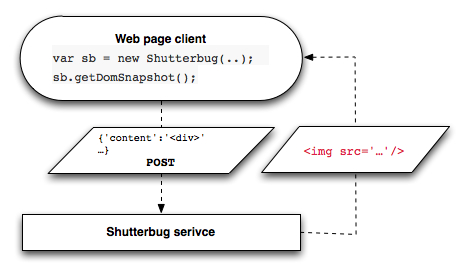

# Shutterbug

## Overview ##

A rack utility using phantomjs that will create and save images (pngs) from parts of your html's documents current dom. These images become available as public png resources in the rack application. Currently shutterbug supports HTML, SVG and Canvas elements. Here is a sample config.ru file:

    use Shutterbug::Rackapp do |config|
      conf.resource_dir       = "/Users/npaessel/tmp"
      config.uri_prefix       = "http://shutterbug.herokuapp.com"
      config.path_prefix      = "/shutterbug"
      config.phantom_bin_path = "/app/vendor/phantomjs/bin/phantomjs"
    end

Configuration options default to reasonable defaults.

Shutterbug is distributed as a Ruby Gem. The rack service delivers a javascript library to the browser that can send HTML fragments back to the Rack service. The Rack service generates images from these fragments using PhantomJS.  In the following image “getDomSnapshot()” triggers a request to the Shutterbug service.  The response from the POST request contains an image tag, that points to a newly created image on the server.

  

## Requirements & Dependencies

  * shutterbug.js requires [JQuery](http://jquery.com/), and expects JQuery to be found via window.$ . Note that shutterbug will allow you to pass in JQuery through its constructor too, in the event that its not at window.$
  * Ruby 1.9x or greater is required to run the Rack application.
  * [PhantomJS](http://phantomjs.org/) is requird to run the Rack application.

## Installation

Add this line to your application's Gemfile:

    gem 'shutterbug'

And then execute:

    $ bundle

Or install it yourself as:

    $ gem install shutterbug

## License ##

* [Simplified BSD](http://www.opensource.org/licenses/BSD-2-Clause),
* [MIT](http://www.opensource.org/licenses/MIT), or
* [Apache 2.0](http://www.opensource.org/licenses/Apache-2.0).

See [LICENSE.md](LICENSE.md) for more information.

## Usage

After adding `use Shutterbug::Rackapp` to your config.ru file, you can convert pieces of your web-page into png images.  Just follow these steps:

Include the following javascript in your pages:

     

Elsewhere in your javascript, something like this:

      var shutterbug = new Shutterbug('#sourceselector', '#outselector',optCallbackFn, optIdentifier);
      $('#button').click(function() {
        shutterbug.getDomSnapshot();
      });

This will replace the contents of `$("#outselector")` with an `/gete_png/sha1hash>` tag which will magically spring into existance.  `optCallbackFn` is an optional callback function which will be invoked with the `` tag. `optIdentifier` is useful when there are multiple snapshot buttons targetting multiple iframes, and you need to verify the destination for various snapshot window message events.

## Advanced usage

### IFrame support

If the element being snapshot'd is an iframe then the iframe needs to handle a postMessage API.
Shutterbug will run something like the following JS to get the html of the iframe

    iframe.contentWindow.postMessage(JSON.stringify({
      type: 'htmlFragRequest',
      id: id
    }), "*");

It is passing a JSON message that specifies the 'type' of message and passes an id so the caller can match up the response.
Currently the id will be the optIdentifier passed to the Shutterbug constructor in the parent window.
The iframe should respond by posting back to the source window a message like:

    message.source.postMessage(JSON.stringfy({
      type:  'htmlFragResponse',
      value: {
        content: 'htmlContent'
        css: '
<link rel='stylesheet'..>
',
        width: width,
        height: height,
        base_url: 'url that resource urls in content and css are relative to'
        },
      id:    id  // id sent in in the 'htmlFragRequest'
    }), message.origin);

The `shutterbug.js` script actually adds a handler for this postMessage API when the Shutterbug constructor is called.
So if shutterbug is included in the iframe html as described in the Usage section above, then a parent page can snapshot
the iframe. The iframe's html doesn't need the button with a click hander because the parent window will trigger things.
Additionally the `#outselector` in the iframe is not used.

You could also reimplement this API in the html of the iframe if you'd like. However the shutterbug implementation includes
some useful things like finding and including all the css on the page, and 'serializing' canvas elements into images.

### Shutterbug JQuery custom events ###

Shutterbug emits a jQuery custom event called `shutterbug-saycheese` just prior to copying styles, elements, and canvas contents to the document fragment. This allows applications to do any preparation required before they are ready to be snapshotted.

In your application, you can register your event-handler like this:

      $(window).on('shutterbug-saycheese', function() {
        api.renderCanvas();
      });

After all elements are copied, emits a `shutterbug-asyouwere` event.

### Deploying on Heroku ###

To deploy on heroku, you are going to want to modify your stack following [these instructions](http://nerdery.crowdmob.com/post/33143120111/heroku-ruby-on-rails-and-phantomjs).

Your app should have a config.ru that looks something like this:

    require 'shutterbug'
    require 'rack/cors'

    use Rack::Cors do
      allow do
        origins '*'
        resource '/shutterbug/*', :headers => :any, :methods => :any
      end
    end

    # Without a complete set of S3 credentials, Shutterbug
    # Places images in a temporary directory where
    # you will LOSE your images...
    use Shutterbug::Rackapp do |config|
      config.uri_prefix = "http://<your app name>.herokuapp.com/"
      config.path_prefix = "/shutterbug"
      config.phantom_bin_path = "/app/vendor/phantomjs/bin/phantomjs"
      # config.s3_key       = "your_S3_KEY"
      # config.s3_secret    = "your_S3_SECRET_DONT_COMMIT_IT"
      # config.s3_bin       = "your_S3_bucket_name"
    end

    app = proc do |env|
      [200, { 'Content-Type' => 'text/html' }, ['move along']]
    end

    run app

And a Procfile which looks like this:

    web: bundle exec rackup config.ru -p $PORT

## TODO: ##

*  Configuration of the rack paths.
*  Fix web-font bugs in phantom js.
*  Better abstraction phantomjs command line invocation. Use phantomjs.rb ?
*  Use [sprockets](https://github.com/sstephenson/sprockets) for and coffee.erb for shutterbug.js
*  Write Tests.

## Contributing

2. Join the mailing list: [email](mailto:shutterbug-dev+subscribe@googlegroups.com) or [web](https://groups.google.com/forum/?hl=en#!forum/shutterbug-dev)
2. Fork this project.
2. Create your feature branch (`git checkout -b my-new-feature`)
3. Commit your changes (`git commit -am 'Add some feature'`)
4. Push to the branch (`git push origin my-new-feature`)
5. Create new Pull Request

© 2013 The Concord Consortium.
